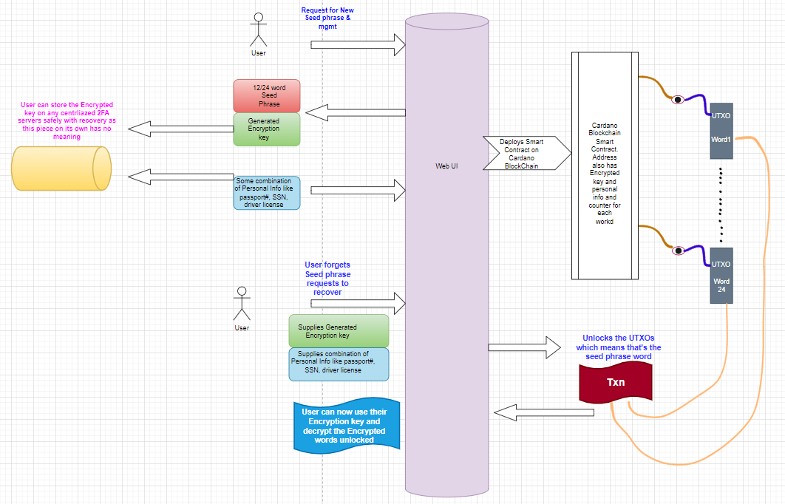

# Decentralized Seed Phrase Recovery

Managing Seed phrase for Web3 is tough ask, not only for new users who are non-technical and/or not too savvy and also not realizing importance of these keys but even for technically experienced. Either we end up being quite paranoid not to lose the key and come up with ways ourselves or we see users forget where they stored etc.

This project offers a way to store the seed phrase On Chain in an encrypted fashion so it can be recovered and relieving the stress of trying to secure it w/o getting hacked etc.

### Web Application Front end

A web application front end will enable user to first create their Seed phrase.

### Seed phrase

User will get the seed phrase of 15 word or 24 hr word phrase. They can write it down or keep it like you would normally.

### Encrypted Key

Then the application will generate an encrypted key with something like a Fernet encryption key. This key they NEED to keep it safely. User can keep this in normal centralized cloud storage accounts which has easy recover methods with 2FA etc in case they forget this key.

Also this encrypted key on its own is NOT much value for anyone else. Since even if the hacked they would still NOT know the seed phrase and its meaningless for them to have this encryption key as they dont know the words to be applied.

### Personal Identification Hash

The user will also choose some combined personal identification information like passport or drive license or Social security number etc

 

### Parameterized Smart Contract

This project will then build a parameterized Smart contract on Cardano blockchain that will use the encryption key, hashed personal info and the seed phrase count as parameters and will store in the Datum each word in an encrypted. 

So example if we have a 12 word seed phrase we have 12 UTXO’s created and stored and each Datum stores 1 encrypted word of the seed phrase.

 

### Seed Phrase Recovery

When the user in future forgets/lost the seed phrase and wants to recover then they simply need the encrypted Key and their personal info.

Then on Cardano blockchain they can Redeem the encrypted key word – basically the UTXO that gets unlocked means you know that is the encrypted word and since they also have the encryption key they can decrypt the word. So each of the UTXO’s for each of the seed phrase word is recovered like that. Technically they don’t need to unlock the Funds but its just to know its their word. 

