# Decentralized Seed Phrase Recovery


Managing Seed phrase for Web3 is tough ask, not only for new users who are non-technical and/or not too savvy and also not realizing importance of these keys but even for technically experienced. Either we end up being quite paranoid not to lose the key and come up with ways ourselves or we see users forget where they stored etc.

This project offers a way to store the seed phrase On Chain in an encrypted fashion so it can be recovered and relieving the stress of trying to secure it w/o getting hacked etc.


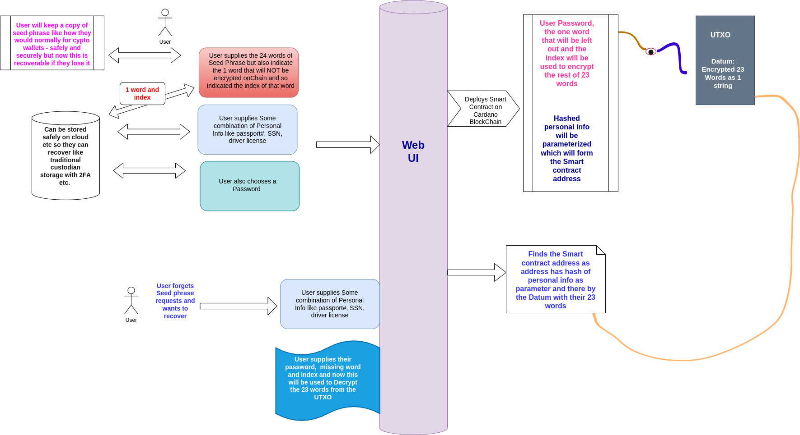


### Web Application Front end

A web application front end will enable user to first create their Seed phrase or they can also bring their Seed phrase they want to have recovery on.

### Seed phrase

User will get the seed phrase of 24 hr word phrase. They can write it down or keep it like you would normally.


### Recovery Info


#### Secret Word and Index

User will choose one out of the 24 words that will NOT be stored onChain but instead will themselves keep it and also the index of it. This will form part of their recovery. 

#### User Password

User will then also supply a password that will be part of the recovery.


#### Personal Identification & Hash

The user will also choose some combined personal identification information like passport or drive license or Social security number etc of their choice. This will be hashed as part of the Decentralized Seed Phrase Smart contract. 


### Encryption

Then the application will then use the password, 1 word left out with index as part of encryption to encrypt the remaining 23 words. We will use some form of AES ([Advanced Encryption Standard](https://en.wikipedia.org/wiki/Advanced_Encryption_Standard) ) encryption to encrypt the rest of the words.

Below is an example. So in this example our encrypted string is `U2FsdGVkX1+tz5nkrdI4eX34/tBFPy+MeSM2AHTTU2A+CEyqORTdZXqPF5TVXBfn`

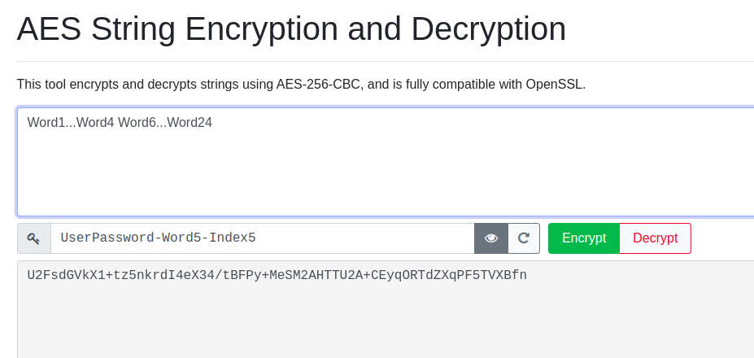


User can keep the recovery info of User Password, 1 word and index and the personal information provided safely in any normal cloud storage or other current methods etc where its easily recoverable with 2FA etc too since this info has no meaning on its own in context of the wallet. 


 

### Parameterized Smart Contract

This project will then build a parameterized Smart contract on Cardano blockchain that will use the hashed personal info as a parameter and will store in the Datum the encrypted 23 words. 


 

### Seed Phrase Recovery

When the user in future forgets/lost the seed phrase and wants to recover then they simply need their personal info, password, the secret word with index.

Then on Cardano blockchain the personal info hashed is used to find the UTXO that has the encrypted rest of the key words. Then once they now have the encrypted string with AES they can use their password, left out word with index to decrypt this.


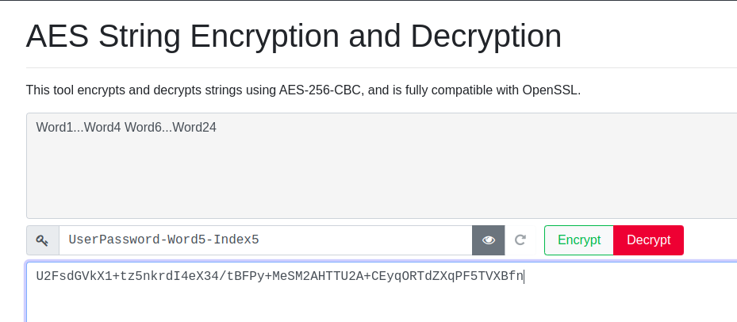


### Recursive Encryption 

To increase the computational cost for hackers to brute force we will be using recursively encrypt multiple times to increase the cost to try to hack.

Project will use 100 times + index of word times recursive encryption. The idea is to increase the decrypt computational time cost so brute force algorithms will incur more cost.


example recursion 3 times- 

Step 1 - 

U2FsdGVkX1+tz5nkrdI4eX34/tBFPy+MeSM2AHTTU2A+CEyqORTdZXqPF5TVXBfn

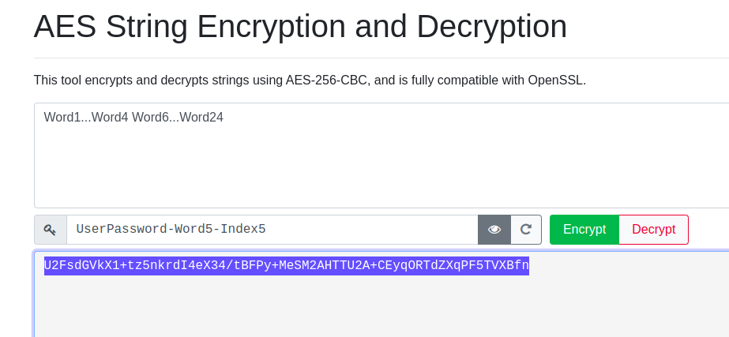

Step 2 - 

U2FsdGVkX1+9Y/FrplmURq+6DxLddfn9lZx9zWka6yLydnXhqNBdX3DcNOGmleaq45kP3XuW/Oi2syaONiioXyE0O1te/9tC1NH4ITp2iAzbFsWzWFkaLtSKA19R80dL


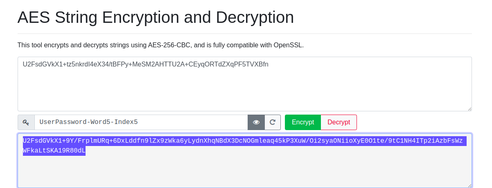


Step 3 - 

U2FsdGVkX19B1Qg9uG4LBlXTJ0I695Hj/ys9kRgUukgH7PTtESyIpEYFZRASyIt+JhKBBxsg/d7punQLGEGXcgOuTHPhgiJwgV4tANa7scKtRp2FJoJkjEDLhs3YG8K3DDUZ93Rs5t2Mozu1tK261Mp0Q2J4tvyir9a5agn6796EiIHmdakzfK1yPMrEqo3XC++KWhjZqoa4Lkusc3dzIQ==

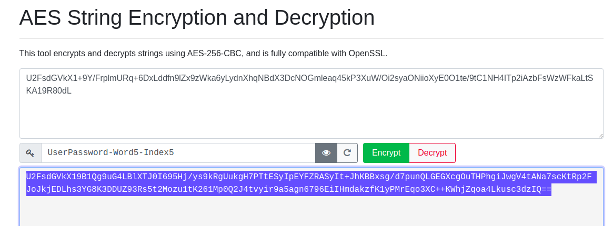


Reverse - 


Step 1  

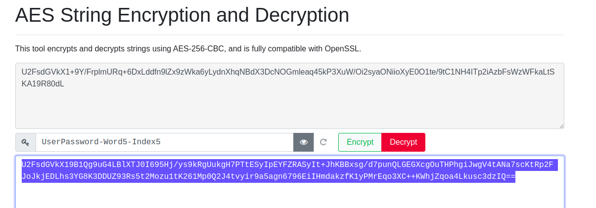


Step 2 - 

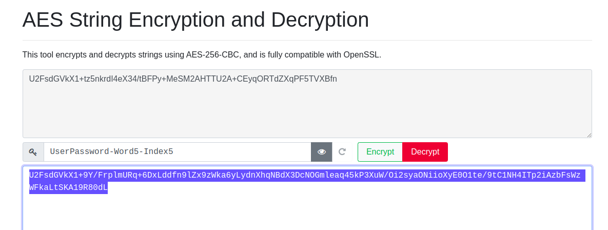


Step 3 - 

To get back the original 23 words.

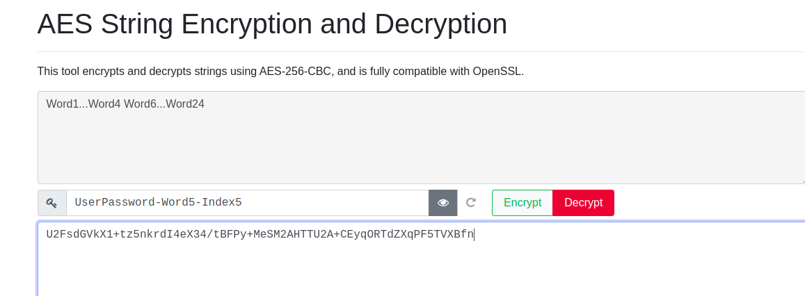


## Pilot Test with Cardano PreProd


### OnChain Code

https://github.com/rchak007/plutusAppsJambhala/blob/main/src/Contracts/SeedPhraseManager.hs


#### Datum

```haskell
data SeedPhraseDatum = SeedPhraseDatum
  { encryptedWordsWithIndex :: BuiltinByteString,
    ownerPKH :: PubKeyHash
  }

unstableMakeIsData ''SeedPhraseDatum

```

#### Parameterized 

```haskell
data SeedPhraseParam = SeedPhraseParam
  { pInfoHash :: BuiltinByteString
  }
  deriving (Haskell.Show)
```


#### Redeemer

```haskell
data SeedPhraseRedeem = Unit ()
```


#### Validator

```haskell
mkRequestValidator :: SeedPhraseParam -> SeedPhraseDatum -> () -> ScriptContext -> Bool
mkRequestValidator sParam dat _ ctx =
  traceIfFalse "signedByOwner: Not signed by ownerPKH" signedByOwner
  where
    txinfo :: TxInfo
    txinfo = scriptContextTxInfo ctx

    signedByOwner :: Bool
    signedByOwner = txSignedBy txinfo $ ownerPKH dat
{-# INLINEABLE mkRequestValidator #-}
```


#### Reference Serialize

```haskell
-- referenceInstance :: Scripts.Validator
referenceInstance :: Validator
-- referenceInstance = Api.Validator $ Api.fromCompiledCode $$(PlutusTx.compile [||wrap||])
referenceInstance = Validator $ fromCompiledCode $$(PlutusTx.compile [||wrap||])
  where
    -- wrap l1 = Scripts.mkUntypedValidator $ mkRequestValidator (PlutusTx.unsafeFromBuiltinData l1)
    wrap l1 = mkUntypedValidator $ mkRequestValidator (PlutusTx.unsafeFromBuiltinData l1)
    
    
    

referenceSerialized :: Haskell.String
referenceSerialized =
  C.unpack $
    B16.encode $
      serialiseToCBOR
        -- ((PlutusScriptSerialised $ SBS.toShort . LBS.toStrict $ serialise $ Api.unValidatorScript referenceInstance) :: PlutusScript PlutusScriptV2)
        ((PlutusScriptSerialised $ SBS.toShort . LBS.toStrict $ serialise $ unValidatorScript referenceInstance) :: PlutusScript PlutusScriptV2)
```


#### Deploy

To get the .plutus script

https://github.com/rchak007/plutusAppsJambhala/blob/main/src/Deploy.hs


```haskell
scripts :: Scripts
scripts = Scripts {reference = Contracts.SeedPhraseManager.referenceSerialized}

main :: IO ()
main = do
  -- writeInitDatum
  -- writeContractDatum

  -- _ <- writeValidatorScript
  -- _ <- writeLucidValidatorScript
  I.writeFile "scripts.json" (encodeToLazyText scripts)
  putStrLn "Scripts compiled"

  return ()
```


### OffChain Encryption Lucid Code


https://github.com/rchak007/decentralSeedRecover/blob/main/pages/offChainV2.tsx


#### Parameter, Datum and Redeemer

```typescript
  const ParamsSchema = Data.Tuple([
      Data.Object({
        pInfoHash: Data.Bytes()
      })
    ]);
  type Params = Data.Static<typeof ParamsSchema>;
  const Params = ParamsSchema as unknown as Params;

  const MyDatumSchema = 
      Data.Object({
        encryptedWordsWithIndex: Data.Bytes(),
        ownerPKH: Data.Bytes()
      })

  type MyDatum = Data.Static<typeof MyDatumSchema>;
  const MyDatum = MyDatumSchema as unknown as MyDatum;

  const Redeemer = () => Data.void();
```


```typescript
// Function that will Lock the UTXO with this Datum 
const sLockEncryptedSeedPhrase = async () => {
    ....
    ....
```


#### Parameterize the script

Gets the personal info from UI and applies the hash to Plutus script.

```typescript
const decentralSeedPlutus = "59087f5908...."

      const paramInit :  Params = [{
        pInfoHash: fromText(hashedDataInString)
      }];
      
      
      const sValidator : SpendingValidator = {
        type: "PlutusV2",
        script: applyParamsToScript<Params>(
          decentralSeedPlutus,
          paramInit,
          Params,
        ),
      }

```


#### Encrypt SeedPhrase into Datum


```typescript

	  seed23Words = seed23InputValue + ' ' + indexInputValue;
      passPhrase = passPhraseinputValue;

      const encryptedS = encryptD( seed23Words, passPhrase)   
      // const encryptedS = encryptSeedPassInfo( seed23Words, passPhrase);
      console.log("encryptedS = ", encryptedS)
      // const encryptedString = String(encryptedS)
      const encryptedString = "testSample1"

      const datumInit : MyDatum = 
          {
            encryptedWordsWithIndex: fromText(encryptedS) ,  
            ownerPKH: paymentCredential?.hash!    // pubkey hash
          };


...
  // Encrypt function
  function encryptD(text: string, key: string): string {
    const encrypted = CryptoJS.AES.encrypt(text, key);
    return encrypted.toString(); // Convert to Base64 string
  }
```


#### Create UTXO with datum


```typescript

...
....

		const tx = await lucid.newTx()
        .payToContract(sValAddress, {inline: Data.to( datumInit, MyDatum)}, {lovelace: BigInt(2000000)})
        .complete();
        const signedTx = await tx.sign().complete();
        const txHash = await signedTx.submit();
        console.log("Lock Test TxHash: " + txHash)
        settxHash(txHash);
        return txHash;
```


### OffChain Decryption Lucid Code


Function `  const sDecentralSeedRedeem = async () => {` decrypts the encrypted seed phrase.

```typescript
  const sDecentralSeedRedeem = async () => {
```


#### Get script address

Gets the personal info from UI and applies the hash to Plutus script to get the script address where UTXO is stored

```typescript
const decentralSeedPlutus = "59087f5908...."

      const paramInit :  Params = [{
        pInfoHash: fromText(hashedDataInString)
      }];
      
      
      const sValidator : SpendingValidator = {
        type: "PlutusV2",
        script: applyParamsToScript<Params>(
          decentralSeedPlutus,
          paramInit,
          Params,
        ),
      }
      
      // this gets our address
      const sValAddress = lucid.utils.validatorToAddress(sValidator)

```


#### Get Datum that has encrypted Seed phrase

```typescript
....
// we get the UTXO's at this address
const valUtxos = await lucid.utxosAt(sValAddress)
....
        for ( let i=0; i<valUtxos.length; i++ ) {
          console.log("I = ", i)
          const curr = valUtxos[i]
          console.log("Curr on i = ", curr)
          console.log("Curr datum on i = ", curr)
            if (!curr.datum) {
              console.log ("came here after the 1st IF")
              if (!curr.datumHash) {
                console.log ("came here after the 1st IF")
                continue;
              }
            }
```


#### Decrypt Seed phrase

```typescript
			


			const encryptedWordsWithIndexFound = utxoInDatum.encryptedWordsWithIndex
            const ownerPubKeyHashFound = utxoInDatum.ownerPKH
            console.log("Encrypted words = ", encryptedWordsWithIndexFound)
            console.log("Owner pubkeyHash = ", ownerPubKeyHashFound)

            // Now Decrypt from the Encrypted word on Datum
            // const decryptedS = decryptD( toText(utxoInDatum.encryptedWordsWithIndex), passPhrase)
            const decryptedS = decryptD( toText(encryptedWordsWithIndexFound), passPhrase)
            console.log("Decrupted 23 words with Index = ", decryptedS)
            varDecryptWord = decryptedS;
            const decryptWord = varDecryptWord;
            // console.log("decryptWord output = ", decryptWord)
            setdecryptWord(varDecryptWord);   // set the output retrieved words


  // Decrypt function
  function decryptD(encryptedText: string, key: string): string {
    // const keyWordArray = CryptoJS.enc.Utf8.parse(key);
    const decrypted = CryptoJS.AES.decrypt(encryptedText, key);
    // const decrypted = CryptoJS.PBKDF2(encryptedText, key);
    return decrypted.toString(CryptoJS.enc.Utf8);
  }
```


### UI for the Dapp


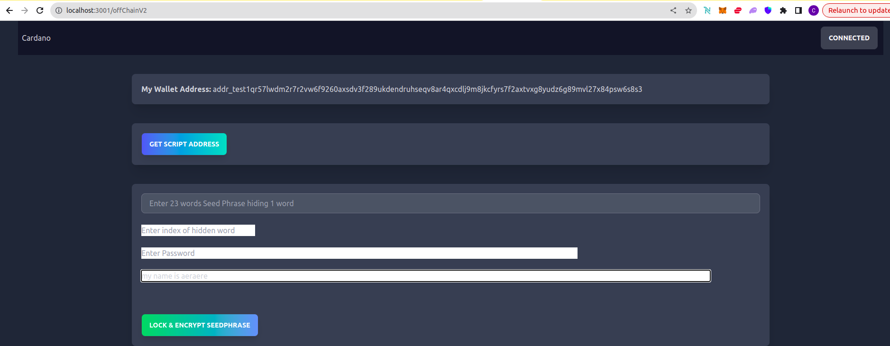


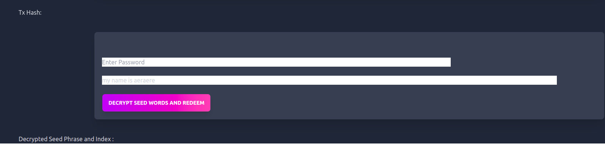


### Lock and Encrypt Seed Phrase

After providing the 23 / 24 words of seed phrase, index of left out word, Pass phrase for recovery and personal info (for Unique script address) the Dapp will put the encrypted seed phrase with index onChain as Datum.

https://preprod.cardanoscan.io/transaction/d28013ffef2018523b125e2bb81a33eb45422f04877480a662bdcdd1ba45478a


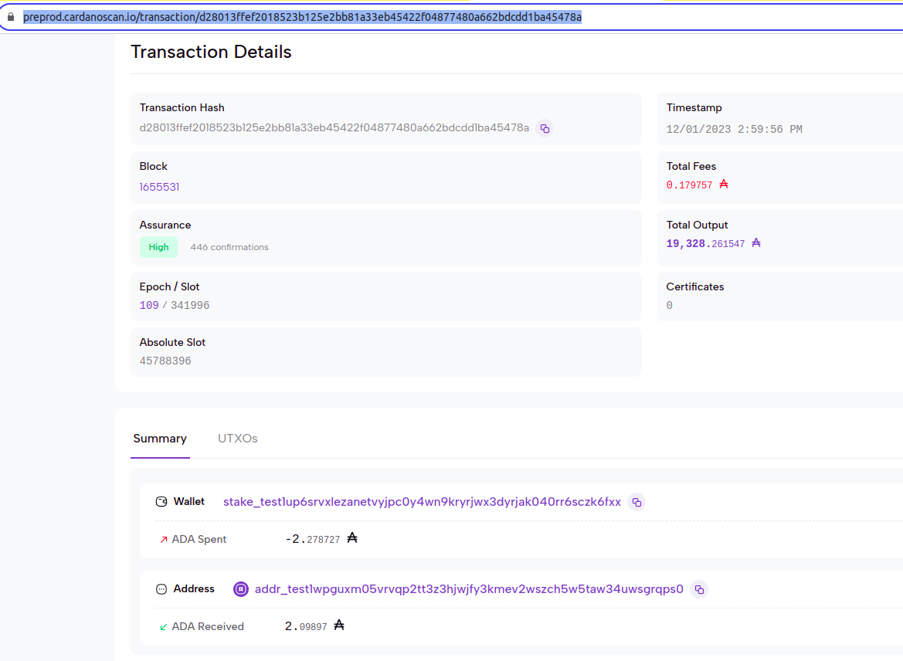


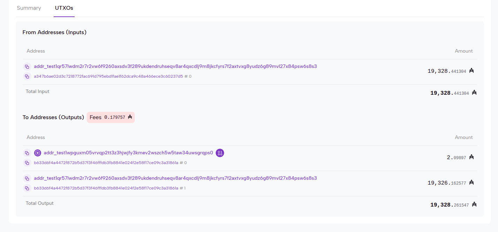


### Datum with Encrypted Seed Phrase 23 words + index of word left out

https://preprod.cardanoscan.io/datumInspector?datum=d8799f5f5840553246736447566b58313830734f713177526b594b745655486674437a4d6d534f7a2f632b6e6f4969754869792f7653683178686b5646626974794e796d2f39584056635975577a57593763527573756544637942546b6c596a485a4a6a6539445363694734417a4f386d70372b365936336571645161345030454155516f4e69555840716b4b33436d7246584c68504b7555757a6c44665033506369743150504d39306c666263382f6f7956322b5177532f4f45632f5a413841783134577a47683553582c6b4b6768384634764e534c7634586d59556444682f2b526a43514b495552695472335745783834754f57343dff581ce9efb9bb50fc3531da4955a7f4d06b22951cbcb373368f978640c3f4ff


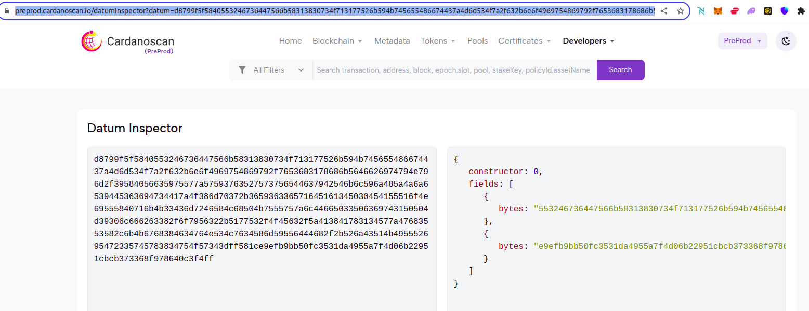


Console log


### Decrypt Seed Words and Redeem


User will provide the Personal info to locate the script address, the passphrase to decrypt the encrypted words.


https://preprod.cardanoscan.io/transaction/b633d6f4a4472f872b5d37f3f46fffdb3fb8841e024f2e58f17ce09c3a31861a


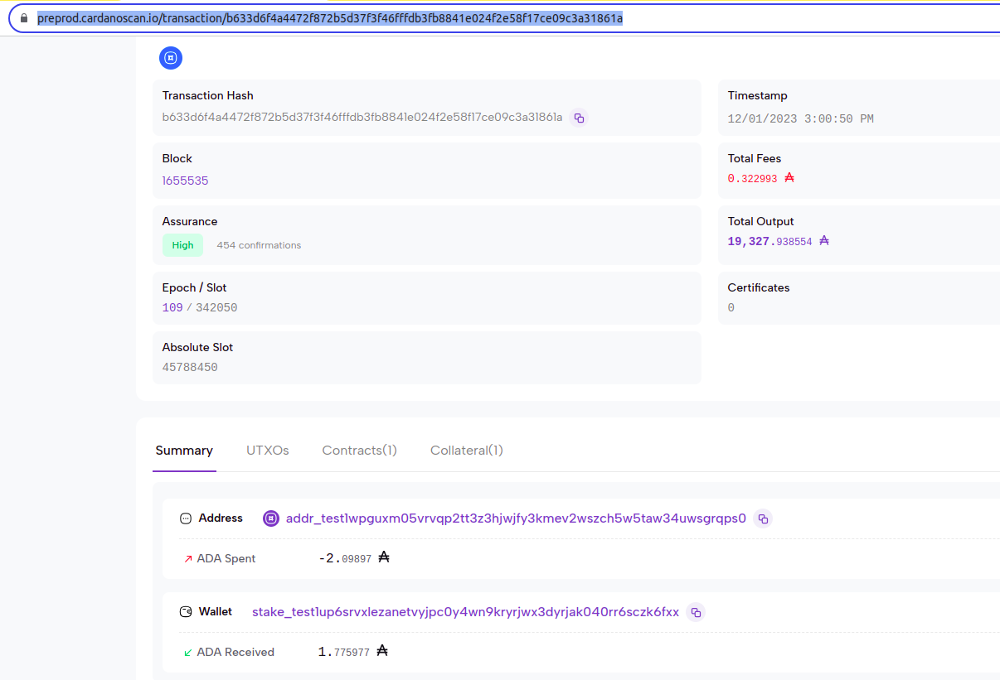


This will decrypt the seed phrase and also redeem the min Ada stored at the script.

This way the user has now recovered their lost Seed phrase.

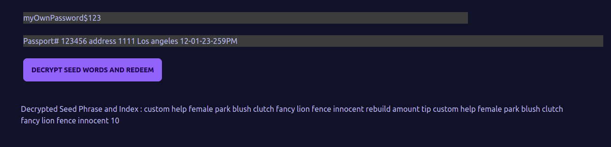


